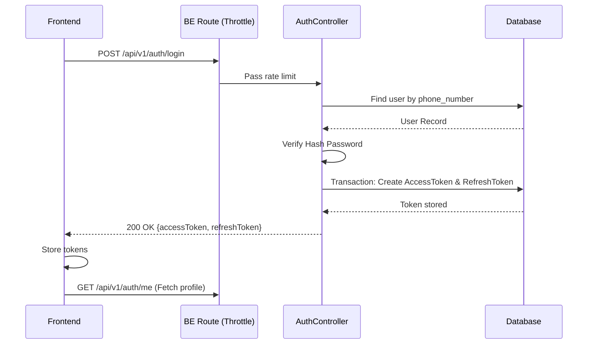

# Authentication Module API Specification

Tài liệu này mô tả chi tiết các API liên quan đến xác thực người dùng (Đăng nhập, Làm mới Token, Thông tin cá nhân).

---

## 1. POST `/api/v1/auth/login`

### 1. Tổng quan
- **Tên API**: Đăng nhập hệ thống
- **URL**: `/api/v1/auth/login`
- **Method**: `POST`
- **Module**: Authentication
- **Phiên bản API**: v1
- **Authentication Required**: No (Public)
- **Permission**: Public
- **Middleware**: `authThrottle` (Chống Spam/Brute force)

### 2. Mục đích
Dùng để xác thực tài khoản dựa trên số điện thoại và mật khẩu. Cấp cho Frontend một cặp thẻ chứng nhận (AccessToken và RefreshToken) để duy trì phiên đăng nhập.

### 3. Khi nào Frontend nên gọi
- Khi người dùng ấn nút "Đăng nhập" trên form form Login.
- Bị văng ra ngoài do hết phiên đăng nhập và cần đăng nhập lại.

### 4. Khi nào KHÔNG nên gọi
- Người dùng đã đăng nhập thành công và token vẫn còn hạn.
- Đang trong quá trình submit (Loading state đang bật).
- Validate phía Frontend (độ dài mật khẩu, format sđt) chưa pass.

### 5. Request
- **Headers**: Không yêu cầu đặc biệt.
- **Path Params**: Không có.
- **Query**: Không có.
- **Body**: 
  - `phoneNumber` (string, **required**): Số điện thoại đăng nhập (Ví dụ: "0901234567").
  - `password` (string, **required**): Mật khẩu (Min 6 ký tự).
  - `rememberMe` (boolean, optional): Tính năng "Ghi nhớ đăng nhập".

**Field Explanation**:
- `rememberMe`: Nếu gửi `true`, phiên đăng nhập có thể kéo dài (thông qua RefreshToken hạn dài 30 ngày). Nếu `false`, hạn chỉ 1 ngày.

### 6. Business Rule
- Mật khẩu được so khớp an toàn thông qua băm (hash). Không có ngoại lệ.
- Nếu gửi sai thông tin (SĐT hoặc Mật khẩu sai), hệ thống sẽ trả chung một lỗi (Không phân biệt lỗi nào để chống dò quét tài khoản).
- Việc cấp phát Token sinh ra 1 Opaque Access Token (lưu CSDL) và 1 chuỗi Refresh Token ngẫu nhiên (lưu CSDL). Hai thao tác này được bọc trong Transaction.

### 7. Response
- **Response DTO**: `LoginResponse`
- **Body**:
  - `accessToken` (string): Chuỗi Bearer token dùng để gán vào `Authorization` Header của các Request sau này.
  - `refreshToken` (string): Chuỗi token dùng để gọi API `/refresh` khi `accessToken` hết hạn.

**Field Explanation**:
- Dữ liệu trả về không có User Profile, Frontend bắt buộc phải gọi API `/me` ngay sau đó.

### 8. Error Handling
- `400 Bad Request`: Mật khẩu hoặc số điện thoại không chính xác.
  - *FE nên xử lý*: Hiển thị Toast hoặc inline error trên Form "Tài khoản hoặc mật khẩu không đúng". Xóa trắng ô password.
- `422 Unprocessable Entity`: Gửi thiếu field hoặc sai định dạng.
- `429 Too Many Requests`: Gõ sai pass quá nhiều lần bị hệ thống chặn.
  - *FE nên xử lý*: Disable nút Đăng nhập và hiển thị Countdown time.

### 9. Frontend Workflow
Sau khi gọi thành công (Status `200`):
1. **Lưu Token**: Lưu `accessToken` vào Memory hoặc Cookie/LocalStorage. Lưu `refreshToken` vào LocalStorage (hoặc HTTP Only Cookie tùy cấu trúc).
2. **Gọi tiếp API**: Gọi `/api/v1/auth/me` để lấy thông tin profile hiện tại (Role, Name, Avatar...).
3. **Cập nhật Store**: Lưu User profile vào Global Store (Redux, Zustand, Context).
4. **Chuyển Route**: Redirect sang trang chủ `/` hoặc trang Admin `/admin` tùy thuộc vào Role.

### 10. Loading Strategy *(Recommended Practice)*
- **Nút Submit**: Thay text "Đăng nhập" thành biểu tượng Spinner quay, vô hiệu hóa nút (Disable) để tránh Double-click.

### 11. Cache Strategy *(Recommended Practice)*
- **Không bao giờ Cache API này**. (Tắt SWR, React Query Cache).

### 12. Retry Strategy *(Recommended Practice)*
- **Tuyệt đối không Retry**. Tránh khóa tài khoản (Throttle limits).

### 13. Side Effect
- **Ghi Database**: Lưu 2 dòng dữ liệu vào bảng `auth_access_tokens` và `refresh_tokens`.

### 14. Sequence Diagram

---

## 2. POST `/api/v1/auth/refresh`

### 1. Tổng quan
- **Tên API**: Làm mới Access Token
- **URL**: `/api/v1/auth/refresh`
- **Method**: `POST`
- **Module**: Authentication
- **Phiên bản API**: v1
- **Authentication Required**: No
- **Permission**: Public
- **Middleware**: `authThrottle`

### 2. Mục đích
Xin cấp lại `accessToken` mới (hạn ngắn) khi Token cũ đã hết hạn, dựa vào `refreshToken` (hạn dài) đang được lưu trữ dưới Client. Tránh việc người dùng phải nhập lại mật khẩu thường xuyên.

### 3. Khi nào Frontend nên gọi
- (Cách 1 - Interceptor): Axios Interceptor bắt được lỗi `401 Unauthorized` từ bất kỳ API nào khác.
- (Cách 2 - Timer): Frontend tự đếm thời gian sống của token và gọi background request trước khi token hết hạn 5 phút.

### 4. Khi nào KHÔNG nên gọi
- Refresh Token dưới LocalStorage rỗng.
- Vừa mới refresh thành công 1 giây trước (tránh vòng lặp vô hạn).

### 5. Request
- **Body**: 
  - `token` (string, **required**): Chính là chuỗi `refreshToken` đã lấy từ API Login.

### 6. Business Rule
- BE sẽ kiểm tra Token này trong DB. Nếu nó không tồn tại, bị thu hồi (`isRevoked`), hoặc hết hạn (`expiresAt`), lập tức ném lỗi 401.
- Chỉ tạo ra `accessToken` mới (1 giờ). Không gia hạn thêm `refreshToken`.

### 7. Response
- **Response DTO**: `RefreshResponse`
- **Body**:
  - `accessToken` (string): Token mới để tiếp tục gọi API.

### 8. Error Handling
- `401 Unauthorized`: Token không hợp lệ, đã bị thu hồi, hoặc hết hạn.
  - *FE nên xử lý*: Catch lỗi này tại Interceptor, lập tức xóa toàn bộ Storage/Cookie, và force redirect người dùng về trang Đăng nhập `/login`.
- `422 Unprocessable Entity`: Payload rỗng.

### 9. Frontend Workflow
- **Cập nhật Store**: Lưu lại `accessToken` mới đè lên cái cũ.
- **Tiếp tục thao tác dở dang**: (Nếu dùng Interceptor) Lấy token mới gán vào các Request đang bị Fail (401) lúc nãy và gửi lại (Resend Failed Requests).

### 10. Loading Strategy *(Recommended Practice)*
- **Không hiển thị Loading UI (Silent Refresh)**: Người dùng không được phép biết quá trình này đang diễn ra. Chặn thao tác (Blocking) ở logic ngầm.

### 11. Cache Strategy *(Recommended Practice)*
- Không Cache.

### 12. Retry Strategy *(Recommended Practice)*
- **Không**. Lỗi 1 lần lập tức Logout.

### 13. Side Effect
- **Ghi Database**: Tạo thêm 1 dòng trong bảng `auth_access_tokens`.

---

## 3. GET `/api/v1/auth/me`

### 1. Tổng quan
- **Tên API**: Lấy thông tin tài khoản đang đăng nhập
- **URL**: `/api/v1/auth/me`
- **Method**: `GET`
- **Module**: Authentication
- **Phiên bản API**: v1
- **Authentication Required**: Yes (Bearer Token)
- **Permission**: Authenticated
- **Middleware**: `auth`

### 2. Mục đích
Dùng để Frontend nạp dữ liệu định danh (Role, Name, Info) và thiết lập Profile (Phân quyền Navbar, Sidebar).

### 3. Khi nào Frontend nên gọi
- Ngay sau khi Login thành công.
- Ngay sau khi F5 (Reload) trang web (khi Store bị mất dữ liệu nhưng Token ở LocalStorage vẫn còn).

### 4. Khi nào KHÔNG nên gọi
- Không có Token ở Storage.

### 5. Request
- **Headers**: `Authorization: Bearer <accessToken>` (**Required**)

### 6. Business Rule
- Middleware `auth` của Adonis đã trích xuất token, query vào DB `auth_access_tokens` lấy ra User tương ứng.
- Controller gọi `.load('profile')` để nạp chi tiết phụ thuộc của User.

### 7. Response
- **Response DTO**: `UserResponse`
- **Body**:
  - `id` (number): Khóa chính
  - `fullName` (string)
  - `phoneNumber` (string)
  - `role` (enum): Cực kỳ quan trọng để FE phân quyền Route (Ví dụ: `ADMIN`, `DRIVER`, `CUSTOMER`, `GUEST`).
  - `avatarUrl` (string | null): URL Ảnh đại diện.
  - `storeName` (string | null): Tên cửa hàng (Đối với khách sỉ).
  - `currentDebt` (string): Công nợ hiện tại (Số thập phân dạng chuỗi).
  - `debtLimit` (string): Hạn mức nợ tối đa.

**Field Explanation**:
- `role`: Dùng để xác định menu hiển thị. Backend trả về chữ IN HOA (`ADMIN`).
- `currentDebt` / `debtLimit`: Frontend phải parse từ string sang Float trước khi render, vì DB đang lưu dạng Decimal để chống sai số float.

### 8. Error Handling
- `401 Unauthorized`: Token truyền lên không hợp lệ, hoặc tài khoản đã bị khóa.
  - *FE nên xử lý*: Redirect về `/login`. Khách đã bị session timeout.

### 9. Frontend Workflow
- **Cập nhật Store**: Khởi tạo biến `currentUser` ở Global State để dùng trên toàn app (Ví dụ Context API / Redux).

### 10. Loading Strategy *(Recommended Practice)*
- **Skeleton / Full Screen Loader**: Nếu gọi API lúc F5, Frontend nên render 1 màn hình xoay (Splash Screen) che toàn app cho tới khi gọi xong để tránh giật lag component do chưa biết Role.

### 11. Cache Strategy *(Recommended Practice)*
- **Stale While Revalidate**: API này có thể được gọi thường xuyên (ví dụ chuyển tab). Nên cache lại bằng React Query / SWR trong thời gian ngắn (~2 phút) để tránh fetch liên tục. Có thể Invalidate khi cập nhật Profile thành công.

### 12. Retry Strategy *(Recommended Practice)*
- **Có**: Có thể Retry 1-2 lần nếu gặp lỗi mạng (Network Error) trước khi đá người dùng văng ra.

### 13. Side Effect
- **Không có**: Thuần túy là API đọc (GET).
