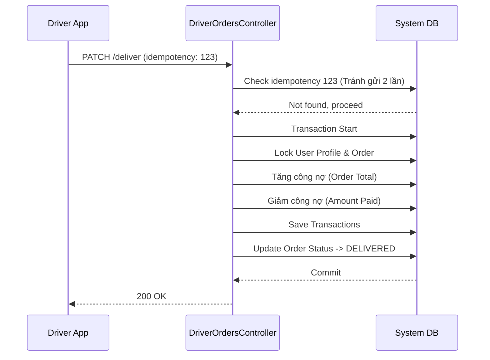

# Driver Module API Specification

Tài liệu này mô tả hệ thống API dành riêng cho Tài xế sử dụng trên Mobile App hoặc Mobile Web.

---

## 1. POST `/api/v1/driver/device-tokens`

### 1. Tổng quan
- **Tên API**: Đăng ký Token Nhận thông báo (FCM)
- **URL**: `/api/v1/driver/device-tokens`
- **Method**: `POST`
- **Authentication Required**: Yes
- **Permission**: Driver
- **Middleware**: `auth`, `driver`

### 2. Mục đích
Gửi Token sinh ra từ Firebase Cloud Messaging (FCM) lên Server để Backend có thể đẩy Push Notification (Ví dụ: "Có đơn hàng mới phân công") về thiết bị của tài xế.

### 5. Request
- **Body**:
  - `token` (string, **required**): Device token lấy từ Firebase SDK ở Frontend.

### 9. Frontend Workflow
- App mở lên -> Request Notification Permission -> Lấy FCM Token -> POST lên API này. 
- API này nên được gọi ngầm.

---

## 2. GET `/api/v1/driver/routes/today`

### 1. Tổng quan
- **Tên API**: Lấy Lộ trình giao hàng hôm nay
- **URL**: `/api/v1/driver/routes/today`
- **Method**: `GET`
- **Authentication Required**: Yes
- **Permission**: Driver
- **Middleware**: `auth`, `driver`

### 2. Mục đích
Trả về toàn bộ danh sách các đơn hàng được chỉ định cho tài xế trong ngày hiện tại. Danh sách đã được sắp xếp sẵn theo `routeOrder` (Thứ tự tuyến đường) từ Admin.

### 3. Khi nào Frontend nên gọi
- Màn hình Home của Driver App (Mở app buổi sáng).
- Pull to refresh.

### 6. Business Rule
- Backend sẽ lọc bảng `Order` theo `driver_id` của tài xế đang đăng nhập.
- Điều kiện `delivery_date` = Hôm nay, và `status` thuộc nhóm đang giao.

### 7. Response
- Trả về mảng các `Order` kèm chi tiết `user` (sđt khách hàng để gọi điện) và `shippingAddress`. 

### 10. Loading Strategy *(Recommended Practice)*
- Sử dụng màn hình Skeleton List Card (Vì UI của tài xế thường là dạng thẻ dọc).

---

## 3. PATCH `/api/v1/driver/orders/:id/deliver`

### 1. Tổng quan
- **Tên API**: Chốt giao hàng thành công & Thanh toán
- **URL**: `/api/v1/driver/orders/:id/deliver`
- **Method**: `PATCH`
- **Permission**: Driver
- **Middleware**: `auth`, `driver`

### 2. Mục đích
Thao tác quan trọng nhất của tài xế. Xác nhận đã giao hàng tận tay khách. Ở bước này, tài xế sẽ nhập số tiền mặt khách đưa. Phần tiền còn thiếu sẽ tự động chạy vào Công Nợ của khách.

### 3. Khi nào Frontend nên gọi
- Khi tài xế ấn nút "Xác nhận giao" và submit số tiền thu được.

### 5. Request
- **Path Params**: 
  - `id`: Mã đơn hàng.
- **Body**:
  - `paymentMethod` (string, **required**): `CASH`, `BANK_TRANSFER`.
  - `amountPaid` (number, **required**): Số tiền khách trả ngay lúc nhận hàng. Nếu khách ký nợ 100%, gửi `0`.
  - `deliveryNote` (string, optional): Ghi chú giao hàng.
  - `idempotencyKey` (string, **required**): Mã chống double-click từ thiết bị của tài xế.

**Field Explanation**:
- `idempotencyKey`: Frontend PHẢI sinh ra một UUID v4 duy nhất khi ấn nút giao. Tránh trường hợp tài xế mất mạng, ấn 2 lần, làm hệ thống hạch toán nhầm 2 lần tiền.

### 6. Business Rule
- Đơn hàng bị Lock Transaction.
- Cập nhật số dư `currentDebt` trong `UserProfile` của khách hàng.
  - Tổng tiền đơn hàng: + Cộng vào nợ.
  - Tiền thu được (`amountPaid`): - Trừ đi nợ.
- Sinh ra tương ứng các bản ghi lịch sử thu chi trong bảng `Transaction`.
- Cập nhật đơn hàng thành `DELIVERED`, `DeliveryStatus.SUCCESS`.

### 8. Error Handling
- `400 Bad Request`: "Idempotency conflict" - Bắt được nếu UUID bị gửi trùng (Do lỗi mạng gửi 2 lần). FE chỉ cần coi như Thành Công và bỏ qua lỗi này.
- Đơn hàng không ở trạng thái hợp lệ.

### 9. Frontend Workflow
- Đóng Popup thu tiền.
- Bắn pháo hoa UI (Success Toast).
- Gạch bỏ đơn hàng đó khỏi List (Refresh lại `/routes/today`).

### 14. Sequence Diagram

### 16. Best Practice
- **Rất quan trọng**: Phải block màn hình điện thoại trong lúc API này đang Pending. Sinh UUID gắn vào Payload.
