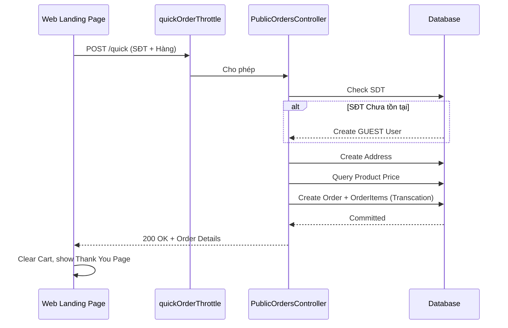

# Public Order Module API Specification

Tài liệu này mô tả chi tiết các API tạo đơn hàng từ Landing Page / Giao diện người dùng vãng lai (B2C Lead Generation).

---

## 1. POST `/api/v1/orders/quick`

### 1. Tổng quan
- **Tên API**: Đặt hàng nhanh (Guest Quick Order)
- **URL**: `/api/v1/orders/quick`
- **Method**: `POST`
- **Module**: Public Order
- **Phiên bản API**: v1
- **Authentication Required**: No (Hoàn toàn Public)
- **Middleware**: `quickOrderThrottle` (Cực kỳ quan trọng để chống SPAM đơn hàng).

### 2. Mục đích
Cho phép khách hàng vãng lai (không cần đăng ký, không cần mật khẩu) truy cập Landing page, chọn mua nhanh và để lại SĐT + Địa chỉ. Đơn hàng sẽ đổ thẳng về Admin.

### 3. Khi nào Frontend nên gọi
- Khi khách hàng nhấn nút "Chốt Đơn" tại form Điền thông tin đặt hàng trên web.

### 4. Khi nào KHÔNG nên gọi
- Đang Loading (Ngừa spam double click).
- Người dùng nhập sai format SDT hoặc thiếu địa chỉ.

### 5. Request
- **Headers**: Không yêu cầu Auth.
- **Body**:
  - `fullName` (string, **required**): Tên khách.
  - `phoneNumber` (string, **required**): Số điện thoại (sẽ dùng làm khóa định danh ngầm).
  - `address` (string, **required**): Địa chỉ văn bản (Không yêu cầu chia tỉnh thành để tối ưu UX nhập liệu nhanh).
  - `note` (string, optional): Ghi chú giao hàng.
  - `items` (Array, **required**): Danh sách sản phẩm mua. Tối thiểu 1 sản phẩm. Mảng chứa `{ productId, quantity }`.

### 6. Business Rule
- **Bảo mật Spam**: Middleware `quickOrderThrottle` sẽ giới hạn số lượng đơn hàng gửi từ 1 IP trong thời gian ngắn.
- **Giá sản phẩm**: Frontend không gửi giá. Backend sẽ gọi `OrderCalculatorService` móc Base Price gốc từ DB để tính `totalAmount`.
- **Luồng Guest User**:
  - Nếu số điện thoại này chưa từng tồn tại, Backend sẽ ngầm tạo một bản ghi `User` (với role `GUEST`) và tạo một `UserProfile` rỗng.
  - Nếu đã có User (kể cả khách sỉ), bỏ qua bước tạo.
  - Cập nhật lại `fullName` của User nếu trước đó rỗng.
- **Luồng Địa chỉ**: Ngầm tạo mới record vào bảng `Address`.
- **Luồng Đơn hàng**:
  - Tạo `Order` với `source = WEB_QUICK_ORDER`. Trạng thái `PENDING`.
  - Ngày giao dự kiến tự động nhảy sang Ngày Hôm Sau (`DateTime.now().plus({ days: 1 })`).

### 7. Response
- Trả về toàn bộ thông tin Đơn Hàng cùng với giỏ hàng đã load (`items`).

### 8. Error Handling
- `429 Too Many Requests`: Đặt quá nhiều đơn liên tục.
  - *FE Xử lý*: Ẩn nút đặt hàng, hiện đếm ngược thời gian, cảnh báo "Bạn thao tác quá nhanh".
- `400 Bad Request`: Sản phẩm đã bị xóa hoặc ngừng kinh doanh.

### 9. Frontend Workflow
- **Cập nhật UI**: 
  - Render màn hình "Đặt Hàng Thành Công / Thank you page".
  - Hiển thị thông báo Cảm ơn kèm Mã Đơn Hàng (id).
  - Xóa trắng Giỏ hàng (Cart) ở LocalStorage.

### 10. Loading Strategy *(Recommended Practice)*
- **Nút Submit**: Loading mờ toàn màn hình hoặc vô hiệu hóa nút submit để ngăn spam.

### 11. Retry Strategy *(Recommended Practice)*
- **Tuyệt đối không Retry tự động** vì API này tạo dữ liệu thật, nếu mạng chập chờn retry sẽ gây lặp 2 đơn.

### 13. Side Effect
- **Ghi Database**: API này tạo ra 1 Transaction rất lớn ghi vào nhiều bảng cùng lúc: `users` (nếu khách lạ), `user_profiles`, `addresses`, `orders`, `order_items`.

### 14. Sequence Diagram

