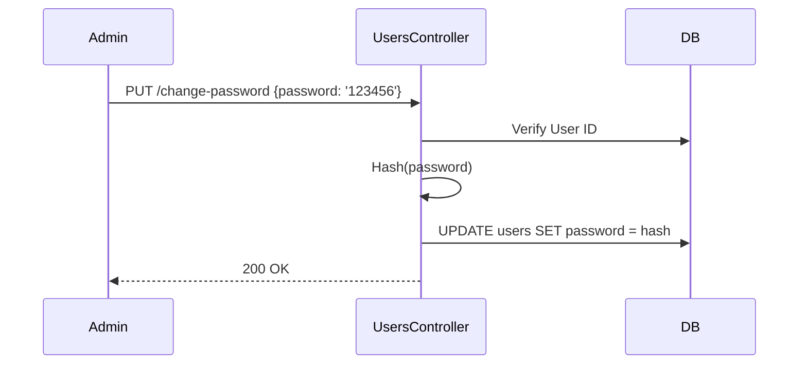

# User Management API Specification

Tài liệu này mô tả chi tiết các API dành cho Admin quản lý danh sách người dùng, khách hàng sỉ.

---

## 1. GET `/api/v1/admin/users`

### 1. Tổng quan
- **Tên API**: Lấy danh sách Người dùng
- **URL**: `/api/v1/admin/users`
- **Method**: `GET`
- **Permission**: Admin
- **Middleware**: `auth`, `admin`

### 5. Request
- **Query**:
  - `page`, `limit` (Phân trang chuẩn).
  - `role` (string, optional): Lọc theo chức vụ (VD: `ADMIN`, `DRIVER`, `CUSTOMER`).

### 6. Business Rule
- Trả về danh sách User sắp xếp mới nhất lên đầu.
- Đã được Preload sẵn Object `profile` (chứa `avatarUrl`, `storeName`, `currentDebt`).

### 7. Response
- Field `profile.currentDebt` đặc biệt quan trọng, đây là nơi hiển thị Công Nợ của khách.

### 10. Loading Strategy *(Recommended Practice)*
- Skeleton DataGrid.

---

## 2. POST `/api/v1/admin/users`

### 1. Tổng quan
- **Tên API**: Tạo tài khoản
- **Method**: `POST`
- **Permission**: Admin

### 5. Request
- **Body**:
  - `phoneNumber` (string, **required**): Phải là duy nhất (Unique DB).
  - `password` (string, optional): Có thể không truyền.
  - `fullName` (string, **required**)
  - `role` (string, **required**): Chỉ nhận `admin`, `driver`, `customer`.
  - `customerType` (string, optional): Chỉ nhận `wholesale` hoặc `retail`. Mặc định là `retail`. (Lưu ý: `customerType` được dùng để phân loại logic giá, không có ý nghĩa Authorization phân quyền API).

### 6. Business Rule
- Tạo User mới, tự động khởi tạo luôn một Profile trống đi kèm (Transaction). Không bao giờ có chuyện User sinh ra mà không có Profile. Trạng thái `customerType` sẽ được lưu vào bảng `user_profiles`.

---

## 3. PUT `/api/v1/admin/users/:id/profile`

### 1. Tổng quan
- **Tên API**: Cập nhật Thông tin Phụ (Profile)
- **Method**: `PUT`
- **Permission**: Admin

### 2. Mục đích
Cập nhật những thông tin như Avatar, Tên cửa hàng, Hạn mức nợ... Thường dành cho việc xét duyệt khách sỉ.

### 5. Request
- **Body**: (JSON thông thường, API này **không** nhận Multipart/Form-data).
  - `storeName` (string)
  - `debtLimit` (number): Mức nợ tối đa (Hiển thị cảnh báo hoặc khóa mua hàng).
  - `avatarUrl` (string): Phải là URL đã được Upload bằng hệ thống Upload API trước đó.

### 6. Business Rule
- FE không truyền File ảnh thẳng vào API này. FE phải gọi Upload API (trả về URL) -> Đưa URL vào trường `avatarUrl` API này.

### 16. Best Practice
- Ở Form tạo khách, khi chọn ảnh đại diện, chạy Upload ngầm để có URL rồi mới Enable nút "Cập nhật".

---

## 3b. PUT `/api/v1/admin/users/:id`

### 1. Tổng quan
- **Tên API**: Cập nhật Thông tin Cơ bản
- **Method**: `PUT`
- **Permission**: Admin

### 5. Request
- **Body**:
  - `fullName` (string, optional)
  - `role` (string, optional)
  - `customerType` (string, optional): Cập nhật thẳng vào `user_profiles.customer_type`.

---

## 4. PUT `/api/v1/admin/users/:id/change-password`

### 1. Tổng quan
- **Tên API**: Cấp lại mật khẩu (Admin)
- **Method**: `PUT`

### 5. Request
- **Body**:
  - `password` (string, **required**)

### 6. Business Rule
- Tính năng Reset Password khẩn cấp. Mật khẩu lập tức bị băm (Hash) thay thế pass cũ.

### 14. Sequence Diagram

---

## 5. Các API Quản lý Bảng giá Riêng (Customer Prices)

### 1. Tổng quan
- Nằm lồng bên trong cấu trúc Users. Dùng để cài đặt giá riêng của từng sản phẩm cho một khách sỉ nhất định.

### 2. Endpoints
- **Admin**:
  - `GET /api/v1/admin/users/:userId/custom-prices`: Lấy danh sách toàn bộ các giá riêng mà khách này đang có.
  - `POST /api/v1/admin/users/:userId/custom-prices`: Cập nhật (Upsert) một mức giá riêng. Truyền Body: `{ productId, customPrice }`.
  - `DELETE /api/v1/admin/users/:userId/custom-prices/:productId`: Xóa bỏ mức giá riêng của 1 sản phẩm.
- **Permission**: Admin.

### 3. Business Rule
- Nếu API Quick Order hoặc Admin Order tạo đơn hàng cho khách này, `OrderCalculatorService` sẽ ưu tiên gọi bảng `customer_prices` để lấy `customPrice`. Nếu bị xóa (DELETE) hoặc không tồn tại, nó sẽ tự động lùi về lấy `basePrice` gốc.
